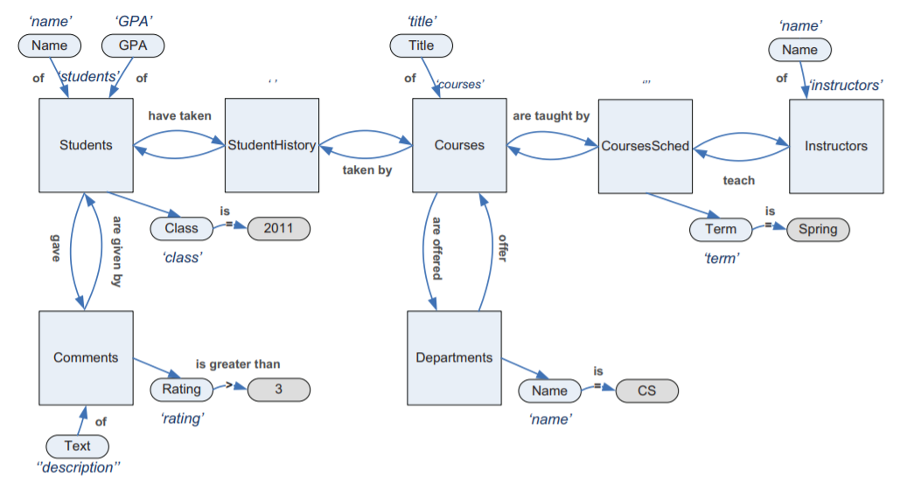

NL-Explanations
===============

Dive into the paper_ *Explaining Structured Queries in Natural Language*

Paper authored by *Georgia Koutrika*, *Alkis Simitsis* and *Yannis E. Ioannidis*

.. _paper: http://www.madgik.di.uoa.gr/sites/default/files/icde10_pp333-344.pdf

Problem to address
==================

The problem that this article tries to tackle down is the translation of a query created with a structured query language, into natural language.

This feature comes handy in a couple of circumstances:

First, when using a form-based interface connected with a database which produces implicitly structured queries, such tool could help the user -that may be not familiar with the structure of the database- by presenting in a more familiar way the result of the user's selections.

Query translation can also be useful as an intermediate step between editing a query and its execution.
An accurate translation of this query can prevent the user from unexpected results or even errors.

The difficulty
==============

The difficulties that occur, do vary:

- Insufficient SQL semantics,

- The complexity of queries, like:

	- nested queries,
	- complex query conditions,
	- different query constructs (group-by, order-by, etc.),

- and last but not least, the naturalness of the produced statement

The last part is crucial. There are many different ways to present a query in natural language. This makes the selection of the order in which the algorithm

Solution
========

The article takes a graph-based approach.

The Schema Graph
^^^^^^^^^^^^^^^^

In the beginning of the executions, it fetches the schema of the database and creates a directed graph, the SchemaGraph. As nodes in this graph we have the ``relations`` (tables) and their ``attributes`` (columns). 

As edges we have the ``membership edges`` that connect an attribute node to its relation node (e.g. client_id `of` client), ``selection edges`` that connect a relation node to its attribute nodes (e.g. client `whose` client_id) and ``predicate edges`` that start from an attribute node and end to another attribute node of another relation. The predicate nodes represent a potential join between two relations.

.. image:: images/join.png
   :width: 600

The Query Graph
^^^^^^^^^^^^^^^

After that, we create the graph of the single query to be translated. The graph followes the logic of the SchemaGraph, where the nodes of the graph are the ``relation nodes`` used in the query -one for every tuple variable-, the ``attribute nodes`` used in any query element, and the ``value nodes`` specified in the WHERE clause of the query.

As for the edges, those are the ``membership edges`` -from the attribute to its relation node-, ``predicate edges`` -for every predicate that from the SchemaGraph its predicate edge ends on a single value or multiple values. The edge denotes a comparison operator and if the end of the edge is an other attribute, then it is a join predicate edge so it captures both ways. Finaly, and interconnected with the predicate edges are the ``selection edges``. These perform the final connection between the predicate that was previously connected with the operators, with its relation. If the end of the predicate edge is an other attribute, then it is a join predicate edge so selection edge goes both ways as well.

.. image:: images/spj.png
   :width: 600

There are additional nodes and edges in addition to the ones presented above, to capture functions, expressions, and renaming operations as well as order-by, group-by and having clauses.

These are, the ``function nodes`` -for representing a function, an expression or a renaming operation that is applied on an attribute/s-, ``transformation edges`` that connect the functions and the attributes that each function is applied to. If the function is in the SELECT clause, the edge is directed towards the atttribute, else, if it is in the WHERE clause it goes the other way around. The ``order edges`` represent ordering by connecting the attributes in the ORDER BY clause, from the container relation of the first attribute to it attribute and from there till the last attribute, while the edge represents if the order is ascending or descending. The same representation goes for the ``grouping edges`` that represent the GROUP BY clause. Finally, for the ``having edges`` that show the HAVING clauses, we have edges that start from the relation node of the participating attribute, to the attribute its self

.. code-block:: postgresql
   :linenos:

	SELECT year, term, MAX(grade)
	FROM studenthistory
	GROUP BY
		year, term
	HAVING
		AVG(grade) > 3

*its query graph is figure (a) below*

The last representation is the subqueries. Each subquery block of a given query is represented as a seperate query subgraph. This virtual relation that is created is connected to the initial query on the selection if the queries are not correlated, if not, then they connect at the represented attributes of the subquery as well. In the case of a subquery in the FROM clause (...). 

.. code-block:: postgresql
   :linenos:

    SELECT s.name
    FROM students s
    WHERE NOT EXISTS
    	(SELECT * 
    	FROM students s2
    	WHERE s2.GPA > s.GPA)

*its query graph is figure (b):*

.. image:: images/functions+.png
   :width: 600

Labels and Templates
^^^^^^^^^^^^^^^^^^^^

*Each node and edge of the graph is annotated by a label.*

We define as the label l of a node v the conceptual meaning of the node, and we denote it as l(v). Value nodes are treated as literals, so their label is their value. The label of a membership edge is also discribed by a label, which shows in natural language the relationship between a table and its columns.

Labels are stored on the database graph for both nodes and edges. A query graph inherits these edges from the database graph. The implementation supports default labels but the user can provide the sustem custom ones through the equivalent talble in the database.

*For producing more natural results*, we define template labels at different granularity levels and we provide an extensible template mechanism to fuse these labels
There are two types of templates, the generic and the specific. The generic ones are defined on edges and are constructed automatically following the form. Specific templates can be defined not only on edges, but on paths as well. These are created manually by a human, and can produce high-quality, concise text. Hence, when they exist, they should be preferred for query translation.

Note, template labels follow the direction of edges. If between two nodes there exist two edges with inverse directions, then template labels may be assigned to both.

Query Translation
^^^^^^^^^^^^^^^^^

**Selection of query subject**

The query subject represents what the query refers to. It is also the starting node for the query graph traverse. It is difficult to identify it when there are more than one relations with projected attributes. This is why we define ``primary relations`` -relations providing information for entries of same type- and ``secondary relations`` that provide information for relationship between tuples of different relations.

Then, the query subject is selected as the primary relation that is most centralized in the query graph. More eleganty, is the primary relation that its greatest distance with any given relation node of the graph is *less* than any other primary relation. The algorithm used is Qsub from therelated work_.

.. _work: http://ilpubs.stanford.edu:8090/935/1/sql2nl-tr.pdf

**Traversal Algorithms**

#. BST Algorithm

The first algorithm produces the following translation:

.. code-block:: none
   :linenos:

   translationString = 'Find ' +pStr+ ' for ' +fStr+ '.' + ' Return results only for ' +wStr+ '.'

where ``pStr`` is the translation of the membership edges, ``fStr`` is the produced string from connecting all the query relations to the subject through the joins in the query, and ``wStr`` is the result of reading the paths that connect relations to value nodes that narrow down the attributes of these relations.

#. MRP Algorithm

#. TS algorithm

#. TMT algorithm

Code Analysis
=============

Database Preperation
^^^^^^^^^^^^^^^^^^^^

**Database Schema**

	- scrap all tables except the ones that start with 'translation'

**Translation Tables**

``translation_attribute_node_labels`` *table, column, label* (e.g.: 'addresses', 'address_id', 'ID')

``translation_primary_relations``  *table* (e.g.: 'clients')

``translation_relation_node_labels`` *table, label* (e.g.: 'ref_skill_levels', 'skill levels')

``translation_heading_attributes`` *table, column* (e.g.: 'staff', 'staff_id')

``translation_edge_operators`` *id, operator* (e.g.: 1, '<')

``translation_edge_types`` *id, type_names* (e.g.: 1, 'MEMBERSHIP')

``translation_paths`` *id, template_id, link_point, where, having, group* (e.g.: 18, 14, 'staff', NULL, NULL, NULL)

``translation_specific_templates`` *id, labels* (e.g.: 1, 'l(clients)+" who live in "+addresses.town_city.<val>')

``translation_edges`` *id, path_id, from, to, type, operator* (e.g.: 14, 1, 'clients', 'client_id', 4, 7)

Structure
^^^^^^^^^

Run it
^^^^^^

Impovements - Ideas
===================

.. toctree::
   :maxdepth: 2
   :caption: Contents:
