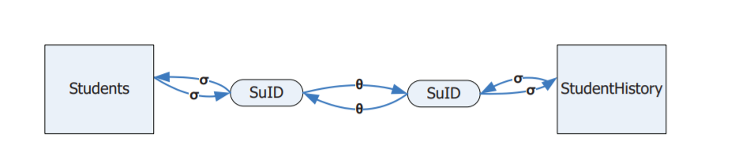
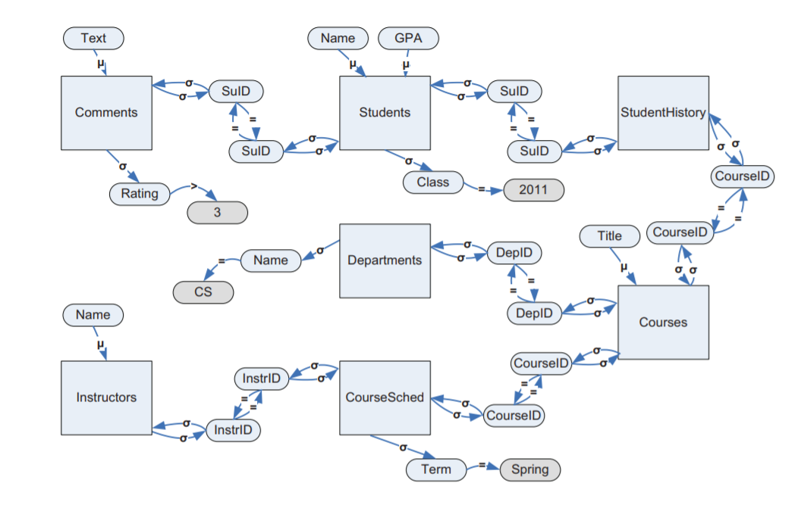
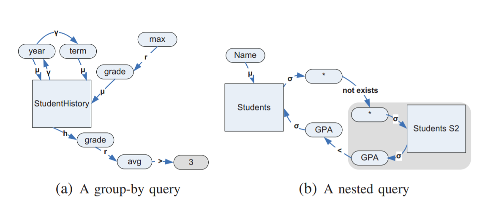

NL-Explanations
===============

The article
===========

*Link for the* publication_.

.. _publication: http://www.madgik.di.uoa.gr/sites/default/files/icde10_pp333-344.pdf

Problem to address
^^^^^^^^^^^^^^^^^^

The problem that this article tries to tackle down is the translation of a query created with a structured query language, into natural language.

This feature comes handy in a couple of circumstances:

First, when using a form-based interface connected with a database which produces implicitly structured queries, such tool could help the user -that may be not familiar with the structure of the database- by presenting in a more familiar way the result of the user's selections.

Query translation can also be useful as an intermediate step between editing a query and its execution.
An accurate translation of this query can prevent the user from unexpected results or even errors.

The difficulty
^^^^^^^^^^^^^^

The difficulties that occur, do vary:

- Insufficient SQL semantics,

- The complexity of queries, like:

	- nested queries,
	- complex query conditions,
	- different query constructs (group-by, order-by, etc.),

- and last but not least, the naturalness of the produced statement

The last part is crucial. There are many different ways to present a query in natural language. This makes the selection of the order in which the algorithm

Solution
^^^^^^^^

The article takes a graph-based approach.

**The Schema Graph**

In the beginning of the executions, it fetches the schema of the database and creates a directed graph, the SchemaGraph. As nodes in this graph we have the relations(tables) and their attributes(columns). 

As edges we have the membership edges that connect an attribute node to its relation node (e.g. client_id `of` client), selection edges that connect a relation node to its attribute nodes (e.g. client `whose` client_id) and predicate edges that start from an attribute node and end to another attribute node of another relation. The predicate nodes represent a potential join between two relations.

**The Query Graph**

After that, we create the graph of the single query to be translated. The graph followes the logic of the SchemaGraph, where the nodes of the graph are the relations used in the query -one for every tuple variable-, the attribute nodes used in any query element, and the value nodes specified in the WHERE clause of the query.

As for the edges, those are the membership edges -from the attribute to its relation node-, predicate edges -for every predicate that from the SchemaGraph its predicate edge ends on a single value or multiple values. The edge denotes a comparison operator and if the end of the edge is an other attribute, then it is a join predicate edge so it captures both ways. Finaly, and interconnected with the predicate edges are the selection edges. These perform the final connection between the predicate that was previously connected with the operators, with its relation. If the end of the predicate edge is an other attribute, then it is a join predicate edge so selection edge goes both ways as well.

There are additional nodes and edges in addition to the ones presented above, to capture functions, expressions, and renaming operations as well as order-by, group-by and having clauses.

The code
========

Database Preperation
^^^^^^^^^^^^^^^^^^^^

**Database Schema**

	- scrap all tables except the ones that start with 'translation'

**Translation Tables**

``translation_attribute_node_labels`` *table, column, label* (e.g.: 'addresses', 'address_id', 'ID')

``translation_primary_relations``  *table*

``translation_relation_node_labels`` *table, label*

``translation_heading_attributes`` *table, column*

``translation_edge_operators`` *id, operator* (e.g.: 1, '<')

``translation_edge_types`` *id, type_names* (e.g.: 1, 'MEMBERSHIP')

``translation_paths`` *id, template_id, link_point, where, having, group*

``translation_specific_templates`` *id, labels* (e.g.: 1, 'l(clients)+" who live in "+addresses.town_city.<val>')

``translation_edges`` *id, path_id, from, to, type, operator* (e.g.: 14, 1, 'clients', 'client_id', 4, 7)

Structure
^^^^^^^^^

Run it
^^^^^^

Impovements - Ideas
===================

.. toctree::
   :maxdepth: 2
   :caption: Contents:

Indices and tables
==================

* :ref:`genindex`
* :ref:`modindex`
* :ref:`search`
